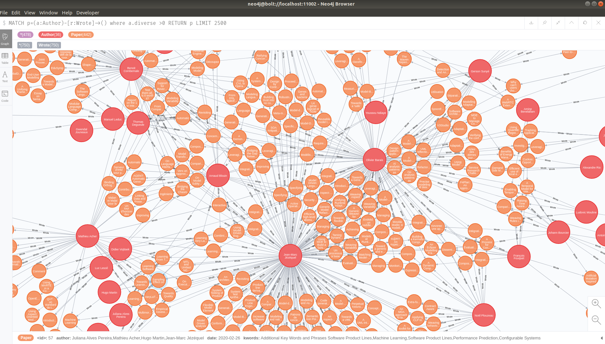
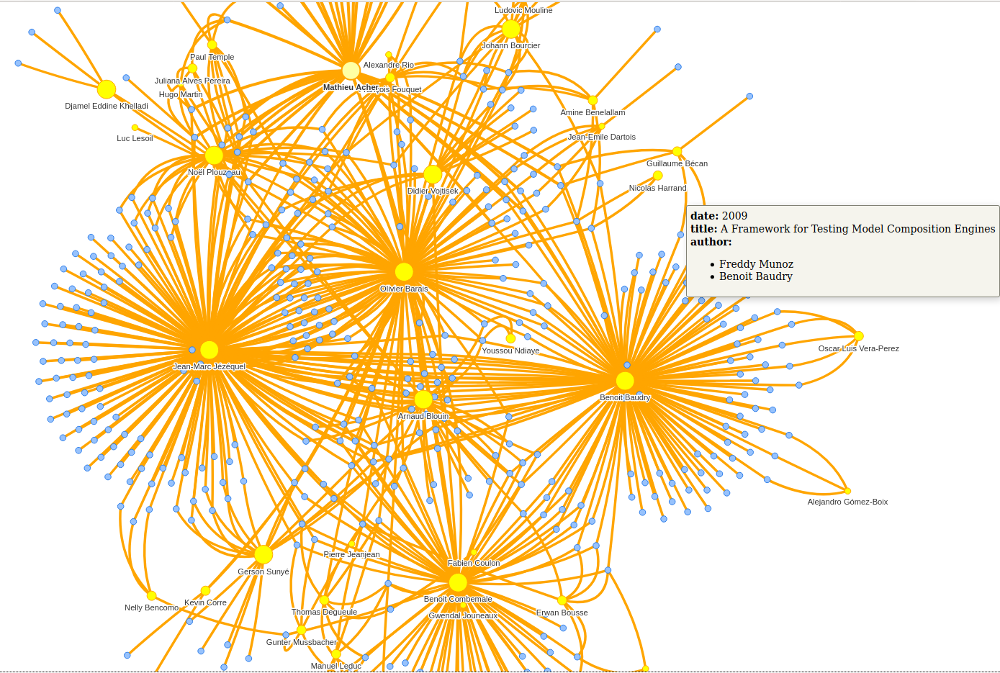
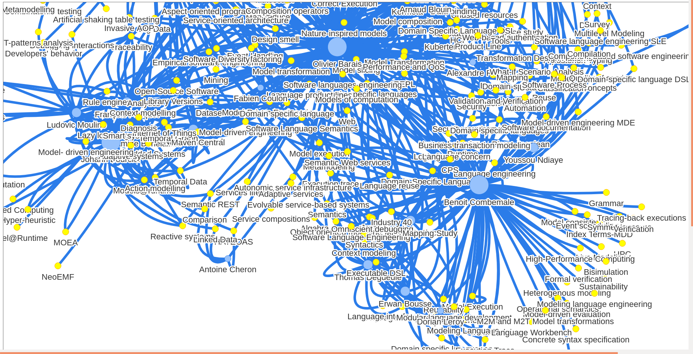

## Research graph

Explaining your research topic is often difficult. And sometimes, you could use a graph to summarize it.

Here, we try to study the research papers stored in [Hal](https://hal.archives-ouvertes.fr/) with the [neo4j](https://neo4j.com/) No SQL database manager.

For an example, here is a screenshot of the graph of the papers written by the [DiverSE](https://www.diverse-team.fr/) research team:

The red nodes represent the researchers, and the orange nodes the research papers.
If someone of the team wrote the paper (or is one of the co-authors), we establish a link (the arrows) between the node of the researcher and the node of the paper.

And we can show the same graph with the authors and the keywords related to the paper.

## Install 

### Neo4J

First of all, you will have to install neo4j. You can download it [here](https://neo4j.com/download/) and follow this [tutorial.](https://neo4j.com/docs/operations-manual/current/installation/) 

If you're working on a laptop, I recommend you to use neo4J-desktop.

You will need to download the apoc library and to allow it in your settings, thanks to the following lines.

<code>
dbms.security.procedures.unrestricted=apoc.trigger.*,apoc.meta.*
dbms.security.procedures.whitelist=apoc.coll.*,apoc.load.*,apoc.*

apoc.trigger.enabled=true
apoc.ttl.enabled=true
apoc.import.file.enabled=true
</code>

If you have a big database, you may want to increase the maximal number of nodes displayed by neo4j.

### Hal API

The documentation is [here.](https://api.archives-ouvertes.fr/docs/ref)

To get the raw_data, just use this [link](https://api.archives-ouvertes.fr/search/?q=structId_i:(2539%20||%20491189)&wt=json&fl=title_s&fl=authFullName_s&fl=journalTitle_s&conferenceTitle_s&fl=producedDate_s&fl=en_keyword_s&fl=doiId_s&rows=9999):

https://api.archives-ouvertes.fr/search/?q=structId_i:(2539%20||%20491189)&wt=json&fl=title_s&fl=authFullName_s&fl=journalTitle_s &conferenceTitle_s&fl=producedDate_s&fl=en_keyword_s&fl=doiId_s&rows=9999

Some important fields:
- structId is the id of your team (ofr multiple teams, use ||)
- authFullName_s is the full name (first + last names) of the authors of the paper. Be careful if you use the authId field, most of researchers have many instances of themselves on Hal. It's easier to detect the duplicates with this field.
- en_keyword_s are the keywords related to the paper
- producedDate_s is the date of publication of the paper
- rows are the maximal number of lines of the json response 

Modify the fields to get the content you want, and export the response in the export.json file (neo4j/paper/export.json).
To get rid of the duplicates names, I created a mapping.csv file; the hal names are in the left column, and you want to replace their values by the names in the right column.

If you're working on a another team, just change the mapping file so it fits to your case.
Once you're satisfied, just apply the map_names.py file (no argument, need to install some packages with pip) with the following command line:

<code>python3 map_names.py</code>

If it worked, it should replace the paper.json file of the paper folder.

You are ready to import your papers in the neo4j database.
Open a neo4j shell and copy paste the following commands:

<code>
WITH "file:/paper.json" AS url
CALL apoc.load.json(url) YIELD value
UNWIND value.response.docs AS item

CREATE (paper:Paper {id: item.id})
SET paper.title = item.title_s,
    paper.author = item.authFullName_s,
    paper.date = item.producedDate_s,
    paper.kwords = item.en_keyword_s;
</code>

OPTIONAL:
If you are working on another team than DiverSE, you will have to create the author database with the command:

<code>match (p:Paper) foreach (k in p.author | merge (a:Author {id : k}));</code>

export all the nodes in the file records.json (neo4j/author/records.json), and modify the file properties.csv:
- name for the researcher's names
- diverse is equal to 1 if the researcher is part of your team, or 0 for a researcher working with your team, but not part of it
- size is the future size of the node. For my team, I displayed the phd student in size 1, the postdoc/graduated phd in size 2, and the permanent member of the team in size 5.

Apply the python script update_script.py

Delete the old database with the following command:

<code>match (a:Author) delete a;</code>

END OPTIONAL

Load the author database:

<code>
WITH "file:/author.json" AS url
CALL apoc.load.json(url) YIELD value
UNWIND value.n AS item

CREATE (author:Author {id: item.properties.id})
SET author.diverse = item.properties.diverse,
    author.size = item.properties.size;
</code>

Generate the keywords database:

<code>
match (p:Paper)
foreach (k in p.kwords | merge (keyword:Kwords {id : k}));
</code>

Create the wrote links (author-> paper)

<code>
MATCH (p:Paper), (a:Author)
WHERE a.id in p.author
CREATE (a)-[w:Wrote]->(p)
RETURN w
</code>

And finally, create the study links (author -> keyword)
It might take a while...

<code>
MATCH (k:Kwords), (p:Paper), (a:Author)
WHERE a.id in p.author and k.id in p.kwords
CREATE (a)-[s:Study]->(k)
RETURN s
</code>

The following request will show you the first screenshot result.

<code>
MATCH p=(a:Author)-[r:Wrote]->() where a.diverse >0 RETURN p LIMIT 2500
</code>

The following request will show you the link author-keyword.

<code>
MATCH p=(a:Author)-[r:Study]->() where a.diverse >0 RETURN p LIMIT 2500
</code>

All the requests are in the cypher file (neo4j/neo4j_requests.cypher).

## Neovis

See the project [here.](https://github.com/neo4j-contrib/neovis.js/)

If you want to embed your graph in a html page, just modify the html pages paper_graph.html and kwords_graph.html.

Replace the server port, the server user and the server password by yours.

If it works, the two webpages should respectively show the two following graphs:

Advantages:
- It's nice to show on a website
- You can identify the main areas of interest of a team

Drawbacks:
- A neo4j server should always run in background
- The pages are slow to load, maybe we have to remove the old papers.
- The design of neovis is not exactly the same as neo4j

Todo:
- For the moment, we have to update the graph manually (not automatic with every paper published in hal)
- Add some information about the team members? Add some team members that I don't know?
- Polish the final results
